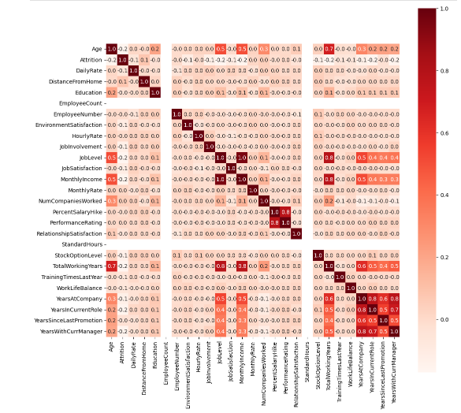
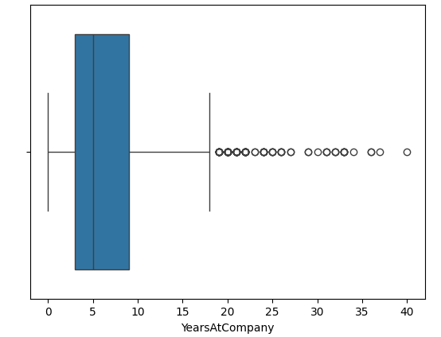
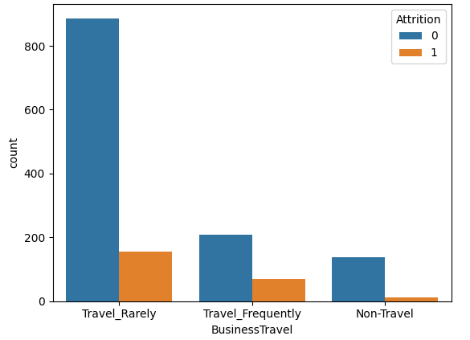
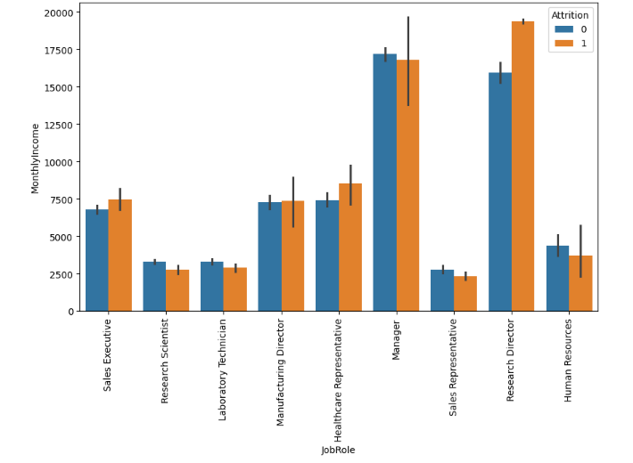
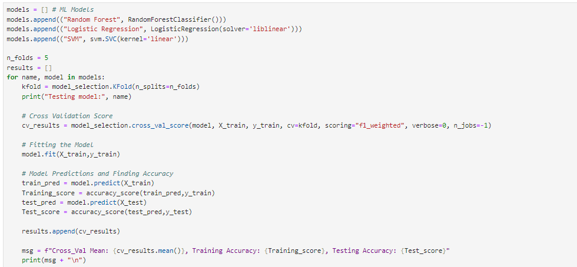

# Employee-Attrition-Prediction

**Overview**
- This project aims to predict employee attrition using various machine learning techniques. Employee attrition is a critical issue for organizations, and understanding the factors that contribute to it can help businesses take proactive measures to retain valuable employees. This project involves data preprocessing, exploratory data analysis (EDA), feature selection, and the implementation of machine learning models to predict whether an employee will leave the company.

**Project Workflow**
- Data Preprocessing:

The dataset is first examined for missing values and irrelevant features. Categorical variables are encoded using Label Encoding, and numerical features are standardized using `StandardScaler`.
- Exploratory Data Analysis (EDA):

EDA is conducted to uncover patterns and relationships within the data. Visualizations such as histograms, boxplots, count plots, and heatmaps are used to explore the distribution of features and their correlations with employee attrition.

- Feature Engineering:

Non-informative features, such as EmployeeCount and StandardHours, are dropped from the dataset. Correlation analysis is performed to identify multicollinearity among the features.
- Model Building:

Multiple machine learning models, including Logistic Regression, Support Vector Machines (SVM), and Random Forest Classifier, are trained on the dataset. The models are evaluated based on their accuracy on the test set.
- Results and Insights:

The models' performance is compared, and key factors influencing employee attrition are identified. The findings are summarized and visualized to provide actionable insights.
**Key Features**
- Heatmap of Correlations:

Visual representation of feature correlations to identify multicollinearity and key drivers of attrition.
- Count Plots:

Analysis of categorical features such as BusinessTravel and Department in relation to attrition rates.
- Boxplots:

Distribution analysis of numerical features like YearsAtCompany to detect outliers and understand their impact on attrition.
- Model Evaluation:

Comparison of different machine learning models to select the most effective one for predicting employee attrition.
**Technologies Used**
- Programming Language: _Python_
- Libraries:
  - `pandas` `numpy` for _Data Manipulation_
  - `matplotlib`, `seaborn` for _Data Visualization_
  - `scikit-learn` for _Machine Learning_

**Conclusion**
- This project provides a comprehensive analysis of employee attrition and highlights the key factors contributing to it. The insights gained from this analysis can help organizations make data-driven decisions to reduce turnover and improve employee retention.

**Acknowledgments**
  - Special thanks to _Kaggle_ for providing the dataset used in this project.
    
- **Important Parts of this projects**

  
  
  
  
  
